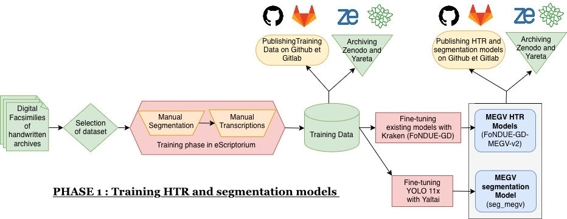
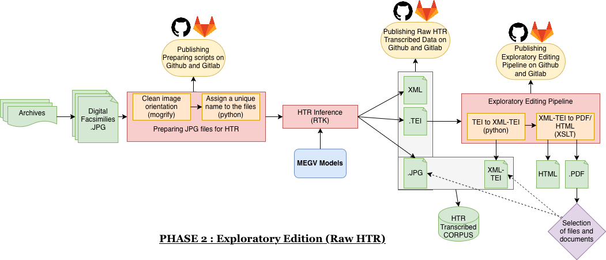
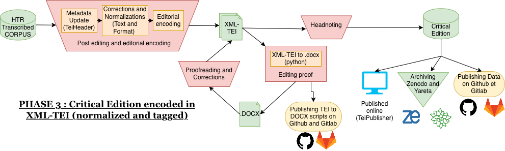

# Masculinites-Esclavagistes

  This repo. contains the description of all repositories of the MEGV project ('Masculinités Esclavagistes : Genre et Violence dans la Caraïbe Française (XVIIIème siècle)', led by Marie Houllemare at the University of Geneva (Switzerland) and financed by the SNSF). It describes all the technical stages of the project and makes it possible to identify the function of each repository. To document the relationship between slave-owning masculinities and violence, the team aims to: 
  - build a coherent corpus of criminal archives within a complex archival landscape—one where few judicial records have survived, and the cases sent to the metropole and preserved are scattered across various French collections, and edit it. 
  - edit a selection of plantation archives.

To do so, digital tools could be useful to : 
- help accelerate the exploration of archives to select corpuses.
- accelerate the transcription of documents.
- prepare an online edition of the corpuses.
- prepare and facilitate the exploitation and analysis of the corpuses.

  ## Phase 1 : Training HTR and Segmentation models

  - Training Data :
  - Segmentation model :
  - HTR model : 

  ## Phase 2 : Inference, Exploratory Edition and Selection of Corpuses
  
  - Preparation of JPG files for Inference :
    -- Script to clean image orientation (for images taken with an iOS device) : 
    -- Python script to assign an unique name to the files : 
  - Data derived from HTR inference : 
  - Python and XSLT scripts to create an exploratory edition of the collections : 

  ## Phase 3 : Critical Edition of the Selected Corpuses
   
  - Editorial Models :
  - Script to transform XML-TEI files to DOCX files for editorial reviews and corrections
  - Data of the critical edition of corpuses :  
